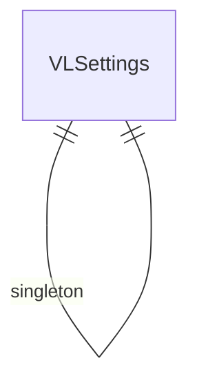

# Velara — Entity Relationship Diagram
# فيلارا — مخطط العلاقات

> 38 DocTypes

> **Note:** This is a placeholder ERD. Update with actual DocType relationships from the JSON definitions.
> Run: `ls velara/velara/*/doctype/` to discover all DocTypes and their Link fields.
