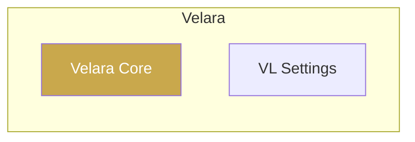

# Velara — Module Map
# فيلارا — خريطة الوحدات

```mermaid
graph LR
    subgraph Velara
        Core["Velara Core"]
        Settings["VL Settings"]
    end
    style Core fill:#C9A84C,color:#fff
```

> **Note:** This is a placeholder module map. Update with actual modules from `modules.txt`.
